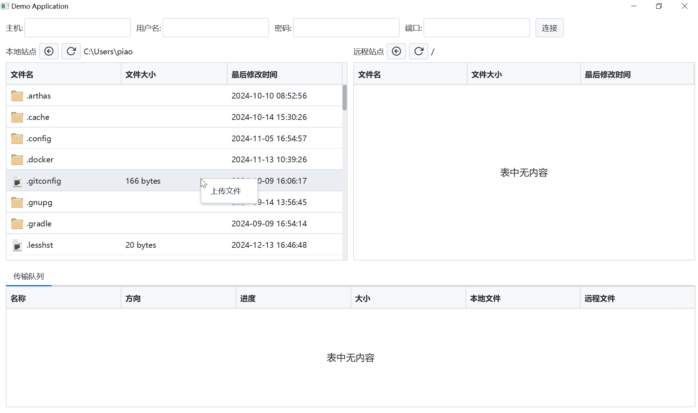

# JavaFX-FTP

JavaFX-FTP-client



## vsftpd setting
```text
require_ssl_reuse=NO
```

## jpackage
```shell
D:\JDK\OpenJDK17U-jdk_x64_windows_hotspot_17.0.12_7\jdk-17.0.12+7\bin\jpackage.exe --type app-image -i D:\IdeaProjects\JavaFX-FTP\target -n JavaFX-FTP-client --main-class org.example.demo.Starter --main-jar demo-1.0-SNAPSHOT.jar
```
